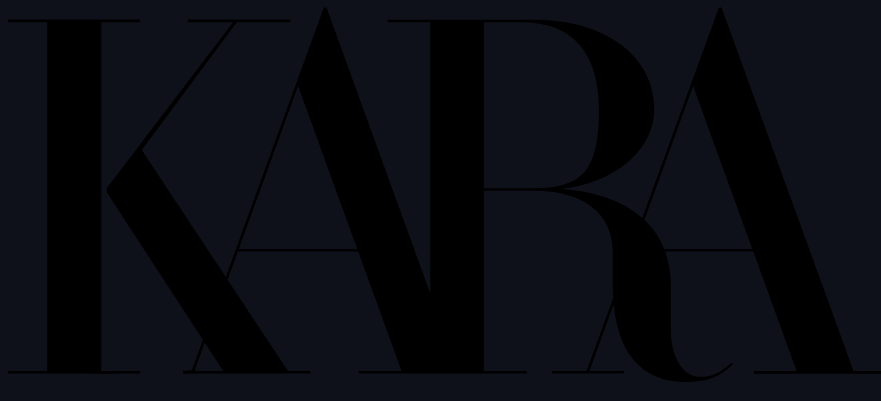

<div>
<br />
  <div align='center'>
  <a href="https://github.com/No-Country/c16-37-m-java-react" target="_blank">
    
  </a>
<h3>Bienvenid@s a Kara E-commerce</h3></div>
<div>
  <p>
    <strong>E-commerce Zara Clone</strong>. Nuestro proyecto Kara es una replica inspirada en la reconocida tienda de moda Zara. Sumérgete en la experiencia de compra en línea con un toque personalizado y la última moda al alcance de tus manos.
  </p>
    <div align='center'>
    <a href="https://stockwise-client.vercel.app/" target="_blank">
          
       </a>
   <a href="https://stockwise-iowo.onrender.com/swagger-ui/index.html" target="_blank">
          
      </a>
    <a href="https://www.figma.com/file/lIB64kDohOKOsdSNGkOSue/c14-22-ft-java-react" target="_blank">
          
      </a>
      <a href="https://github.com/No-Country/c14-22-ft-java-react/issues" target="_blank">
          
      </a>
      </div>
</div>
<!-- ABOUT THE PROJECT -->
<br>
<h1> 

Acerca del Proyecto
</h1>

El E-commerce Zara Clone busca capturar la esencia única de la plataforma original de Zara.
<br>
<h2>Características Destacadas</h2>
<ul>
<li>Exploración de Productos: Navega por una amplia gama de productos organizados de manera intuitiva, desde prendas de vestir hasta accesorios de moda.</li>
<li>Diseño Atractivo: Disfruta de un diseño visualmente atractivo, inspirado en la estética limpia y moderna que caracteriza a Zara.</li>
<li>Filtros y Búsqueda Avanzada: Encuentra fácilmente lo que estás buscando mediante filtros y una función de búsqueda avanzada.</li>
<li>Carrito de Compras: Agrega tus artículos favoritos al carrito de compras y gestiona fácilmente tus selecciones antes de finalizar la compra.</li>

<h1> Tecnologias Usadas
</h1>
<h3>Front-End</h3>


<h3>Back-End</h3>


<!--  -->

<!--

 -->

<h3>Base de datos</h3>


<h3>QA</h3>


<!-- Organización -->
<h1> Organización
</h1>
  
  


<!-- GETTING STARTED -->
<h1> Comenzando
</h1>

Para instalar el proyecto localmente:

Clonar repositorio

```sh
git clone https://github.com/No-Country/c16-37-m-java-react.git
```

Instalar dependencias

```sh
cd .\frontend\ | npm install
```

```sh
VITE_API_URL=https://stockwise-iowo.onrender.com
```

Correr el proyecto

```sh
npm run dev
```

O simplemente clickea en el link de
<a href="https://zara-clone-reactjs.netlify.app/" target="_blank">Ver Demo.</a>


<!-- TEAMS -->

<h1> Equipo ( c16-37-m-java-react )
</h1>

<table align='center'>
  <tr>
    <td align='center'>
      <div >
        <a href="https://github.com/EmiLongo" target="_blank" rel="author">
          
        </a>
        <a href="https://github.com/EmiLongo" target="_blank" rel="author">
          <h4 style="margin-top: 1rem;">Alejo Araya</br><small>Front-End</small></h4>
        </a>
        <div style='display: flex; flex-direction: column'>
        <a href="https://github.com/EmiLongo" target="_blank">
          
        </a>
        <a href="https://www.linkedin.com/in/emilianojlongo/" target="_blank">
          
        </a>
        </div>
      </div>
    </td>
    <td align='center'>
      <div >
        <a href="https://github.com/EmiLongo" target="_blank" rel="author">
          
        </a>
        <a href="https://github.com/EmiLongo" target="_blank" rel="author">
          <h4 style="margin-top: 1rem;">Alejo Araya</br><small>Front-End</small></h4>
        </a>
        <div style='display: flex; flex-direction: column'>
        <a href="https://github.com/EmiLongo" target="_blank">
          
        </a>
        <a href="https://www.linkedin.com/in/emilianojlongo/" target="_blank">
          
        </a>
        </div>
      </div>
    </td>
    <td align='center'>
      <div >
        <a href="https://github.com/EmiLongo" target="_blank" rel="author">
          
        </a>
        <a href="https://github.com/EmiLongo" target="_blank" rel="author">
          <h4 style="margin-top: 1rem;">Alejo Araya</br><small>Front-End</small></h4>
        </a>
        <div style='display: flex; flex-direction: column'>
        <a href="https://github.com/EmiLongo" target="_blank">
          
        </a>
        <a href="https://www.linkedin.com/in/emilianojlongo/" target="_blank">
          
        </a>
        </div>
      </div>
    </td>
  </tr>
  </table>

<!-- Video -->
<h1> Video
</h1>
<p><a href="https://www.youtube.com/" target="_blank"></a></p>
<br/>

<!-- ACKNOWLEDGMENTS -->

<div align='center'>
<h3>Agradecimientos</h3>
  <a href="https://www.nocountry.tech/" target="_blank">
    
  </a>
</div>